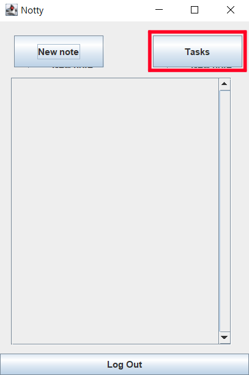
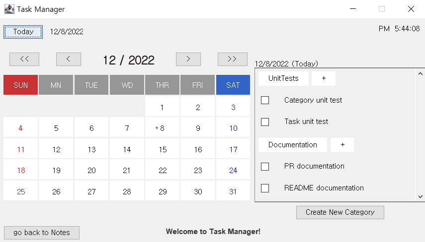
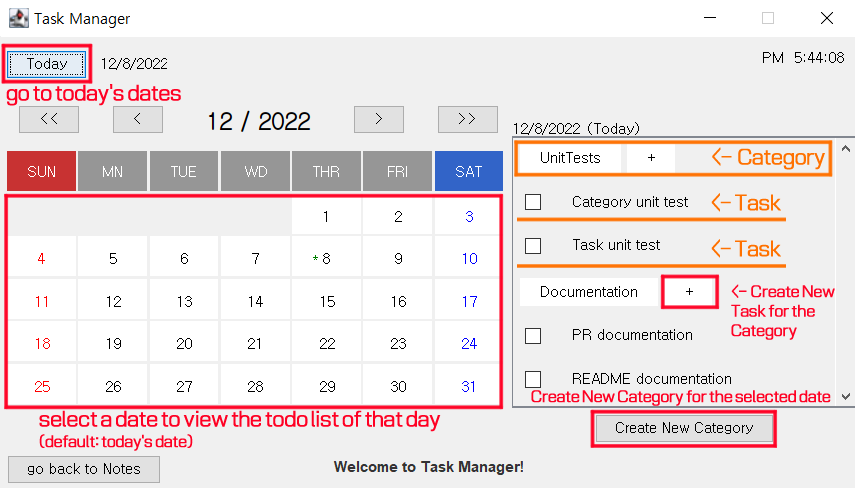
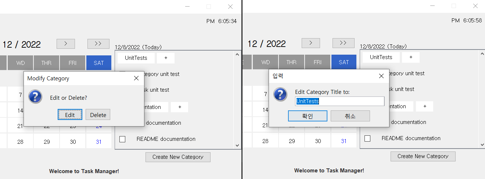
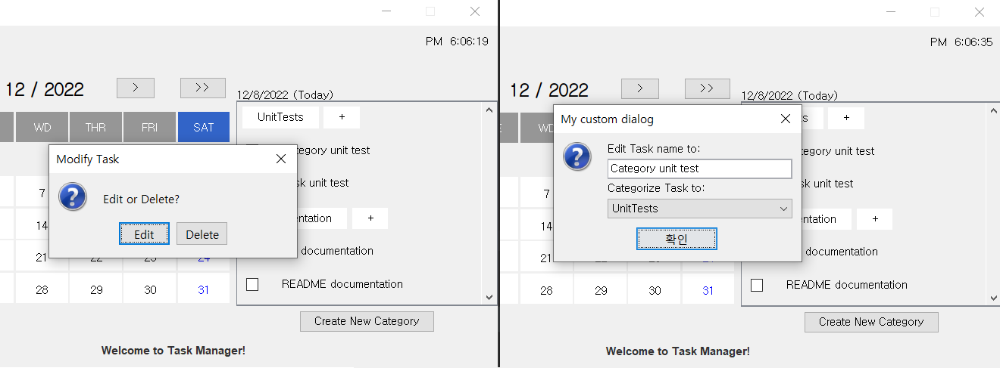
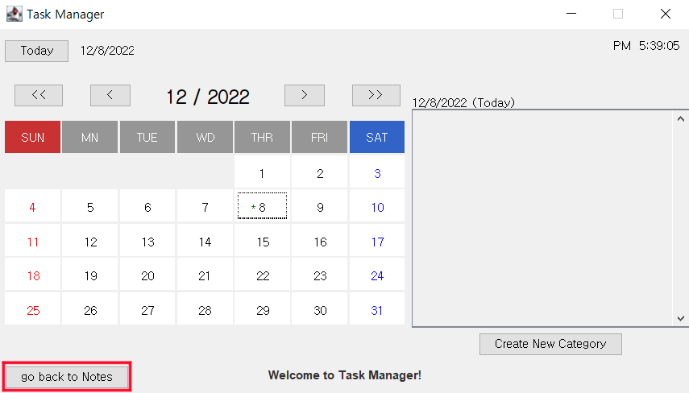

See presentation of the product here: [Presentation.pptx](https://utoronto-my.sharepoint.com/:p:/r/personal/kateryna_kondratiuk_mail_utoronto_ca/Documents/Presentation.pptx?d=wdcbf948c4d3c468997be0e8c40a652ca&csf=1&web=1&e=sCBrEO)

See user story list & product development process: https://docs.google.com/document/d/1WMoYAnK_rc7lyZ81jEHgc-kMHJjea3rPC5QUTU0X9Rc/edit?usp=sharing
# Specifications
1. The user is able to create their own account to manage notes and tasks. When the user is authorized, the program allows them to make use of the following features.
2. Note Taking part includes creating a note, editing, and removing it. Also, user can label and search each note by title or description. Last but no least, we can pin and unpin notes, so that important information is never lost.  
3. Task Managing includes creating a task, editing, categorizing, marking, and deleting the task. The tasks are shown as a calendar so that users can intuitively figure out how much they have achieved.
 
# How to run Notty

1. Clone and open the repository in IntelliJ.
2. Setup the JDK.
3. Select amazon/coretto 11 java 11.
4. In the UI folder, right click on the App class.
5. Click on Run 'App.main()'

# UI Capture & Explanations 

1) Accounts\
The user will first run App.main() in the UI folder, and this welcome screen will pop up,
prompting the user to decide whether they want to log in or sign up into a Notty account.

If the user wishes to sign up, they will be prompted to this screen to enter a unique username and password.
If it is a valid combination, user will be prompted to login with the newly created credentials into
their new account.

If the user wishes to log in, they can click login, and they will be prompted to this screen.
If the credentials they entered are valid, user will be able to login to their account.

2) Notes\

3) Tasks\
In this section of the program the user is able to work
with categories
and tasks on todo lists of each day. 
\
By clicking on the 'Tasks' Button of the 
Notes section, the user is able to move to the
task management system of the program.
\
Below is the description of the UI.
\
Each of the Categories/Tasks are buttons.\
To modify Categories, click on it:
\
To modify Tasks, click on it:
\
To go back to Notes section, click on 'go back to Notes'
on the bottom right corner.

# Testing 
We have unit tests for our application to make sure there is no regression during new changes. They cover different parts of our application. Some of them interact with the database and some tests are basic (testing of constructors, getters & setters).
Possible improvement in this area: 
1) add a separate database for testing
2) integration & e2e testing  

You can view how to launch tests & examples here: https://www.youtube.com/watch?v=t1-Z-Vs0CwQ
