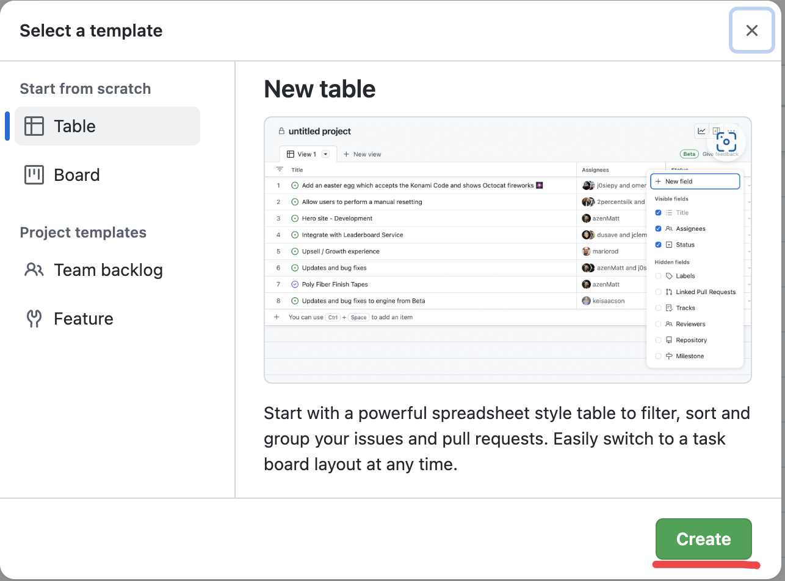
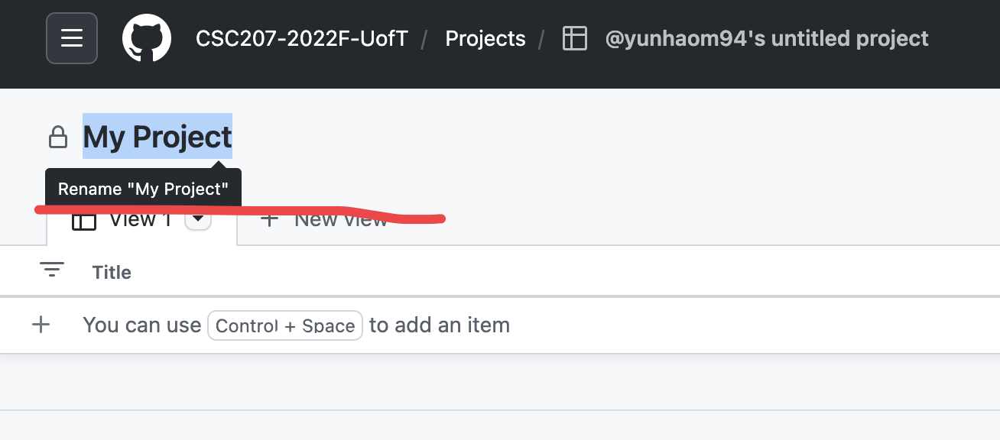
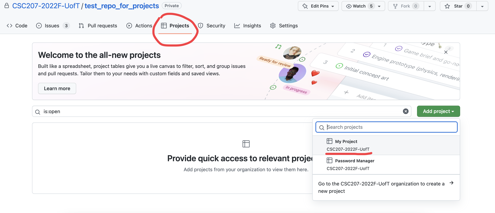
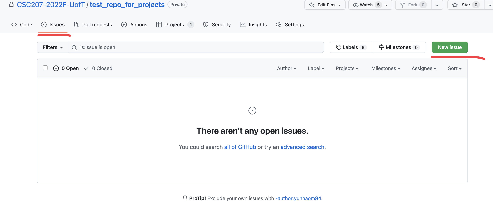
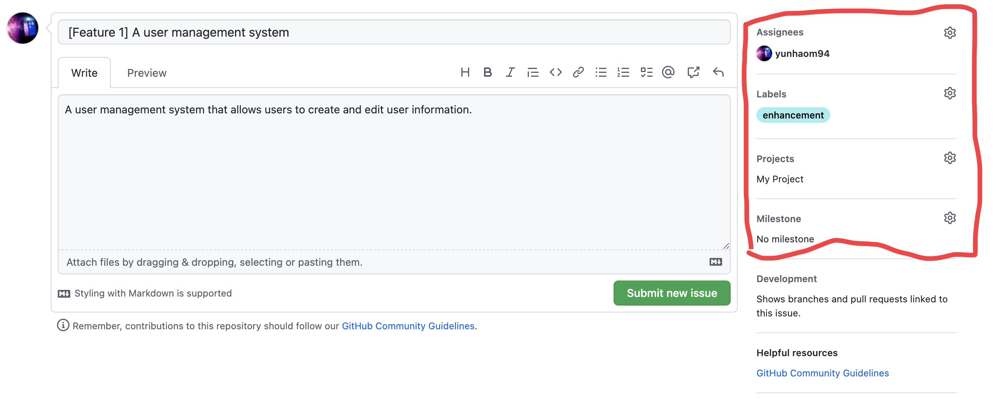
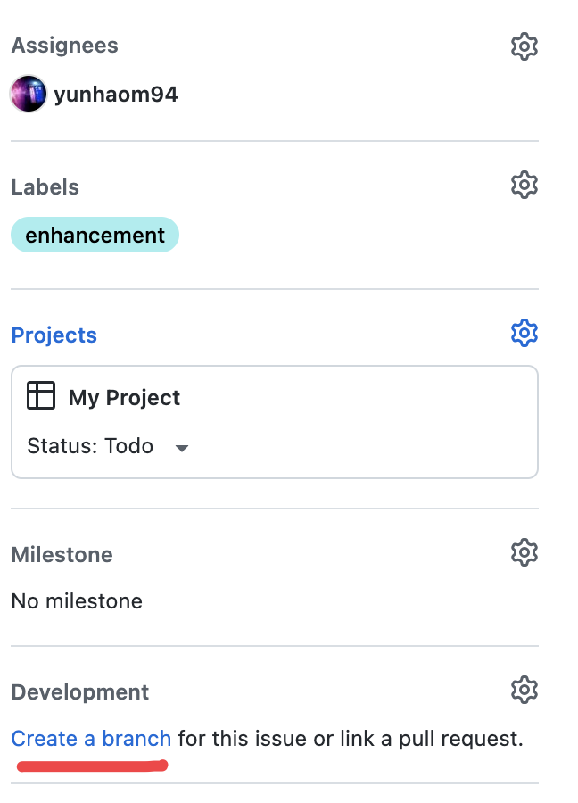
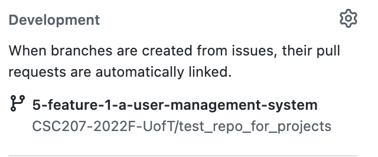
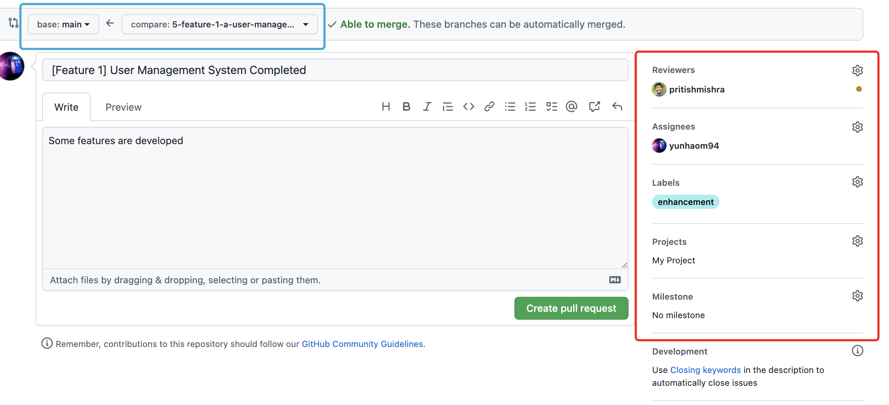

# Project Planning and Development with Github 

In this course project, you are expected to use Github to manage your code. This document describes the workflow for using Github when you are developing the course project. Please read it carefully and follow the instructions. **Try to work through the steps with the help of your team first, but please ask for help if your team gets stuck on any of the steps or needs something clarified.**

## Create a New Github Project
[Github Projects](https://docs.github.com/en/issues/planning-and-tracking-with-projects/learning-about-projects/about-projects) (*Yes, the name of this product is called "Github Projects", do not confuse it with the course project*) is a lightweight project management tool that is integrated to Github. You can use it to track issues, pull requests, visualize tasks status, and track responsibilities. **TAs will mark you project implementation plan and track your progression using the Github project.**

1. Navigate to **Projects** Page on [CSC207 organization page](https://github.com/orgs/CSC207-2022F-UofT/projects)

2. Click **New project**, and click **Create** on the new page.

3. Click the title bar to rename the project to your team/project's name, and press **Enter** to save the change.

4. Link the project to your repository. Navigate to your repository and select **Projects** tab, then click **Add Project** and select the project you just created.

5. The project will show up in the the list below.

## Define Your Features for the Implementation Plan
As a part of the project planning, you are required to record all features formulated from your user stories, as **issues** in your Github repository.

1. Navigate to your repository and select **Issues** tab, then click **New issue**.

1. Fill in the title as the name of the feature and provide a brief description of the feature.
**Please use a consistent naming convention for your issues.** For example, you can use the following format: `[Feature x] <feature name>` 

2. On the side bar, select the **Assignee**, **Labels** (Enhancement for your Features), and **Projects**(the one you just created) for the issue. Then click **Submit new issue**.

3. On the project page, you can see an item is automatically created.  :warning: :warning: **Make sure you verify that each feature issue is successfully created in the project.**  :warning: :warning:

## Feature Development
When you work on a feature, you are always required to create a **branch** for the feature and **merge** the branch back to the main branch with **pull requests** when the feature is completed. Note: the below should remind you of the "workflow" we covered in the first lab this term. Please review the details of that document in addition to the below, which provides additional details about how the process works on GitHub. 

1. To create a new branch, navigate to the issue you are assigned to, and click **Create branch** on the right side bar.

2. Select a name and click **Create branch** on the pop-up window. Use the provided command to check out the branch you just created on your local machine.

    *Alternatively, you can create a branch manually, and link it to the issue.*

3. Verify that the branch is successfully linked to the issue.

## Merge Feature Branch to notes.Main Branch
When you finish working on a feature, you are required to merge the feature branch back to the main branch with a **pull request**.

1. After you make changes to the code and commit them to the feature branch, you will see a **Compare & pull request** button on the repository page. Click it to create a pull request.

    *Alternatively, you can create a pull request in the **Pull requests** tab.*

2. Give a meaningful title and description for the pull request, remember please make the name consistent. 
   
   2.1 First make sure that you are merging from the feature branch to the main branch (see blue box).
   
   2.2 Make sure that you set the correct fields as issues (see red box).

3. Select reviewers for the pull request. You can select multiple reviewers. The reviewers will be notified and will review your code. You can also add comments to the pull request. 

4. After the reviewers approve the pull request, you can merge the pull request. :warning: :warning: **Pull requests
must be reviewed and approved by other team members before merging.** :warning: :warning: **Reviewing and approving pull requests will be a part of the evaluation.**

5. After the pull request is merged, the linked issue will be automatically closed. You can verify that the issue is closed by navigating to the issues page and project page.

6. (Optional) Delete the feature branch after the pull request is merged. You can delete the branch by navigating to the **View all branches** page.

7. (Optional) If the feature is not completed or you want to continue working on the feature, you can reopen the issue and create new pull requests. Remember to change the status of the issue to **In Progress**.

## More Project Management and Other Resoruces (Optional)

- Use issues to keep track of bugs, tasks and other things that need to be done by selecting the appropriate labels.

- Use milestones to group issues into a set of deliverables. To create milestones, navigate to the **Milestones** tab and click **New milestone**.

- Use Projects to tracks issues and collaborate with your team. See the [sample project (Password Manager example)](https://github.com/orgs/CSC207-2022F-UofT/projects/2) for reference.

- Github document for projects: https://docs.github.com/en/issues/planning-and-tracking-with-projects

- Git operations: https://docs.github.com/en/get-started/using-git 

- Git cheat sheet: https://education.github.com/git-cheat-sheet-education.pdf

- I MESSED UP GIT WHAT TO DO?!: https://dangitgit.com/
